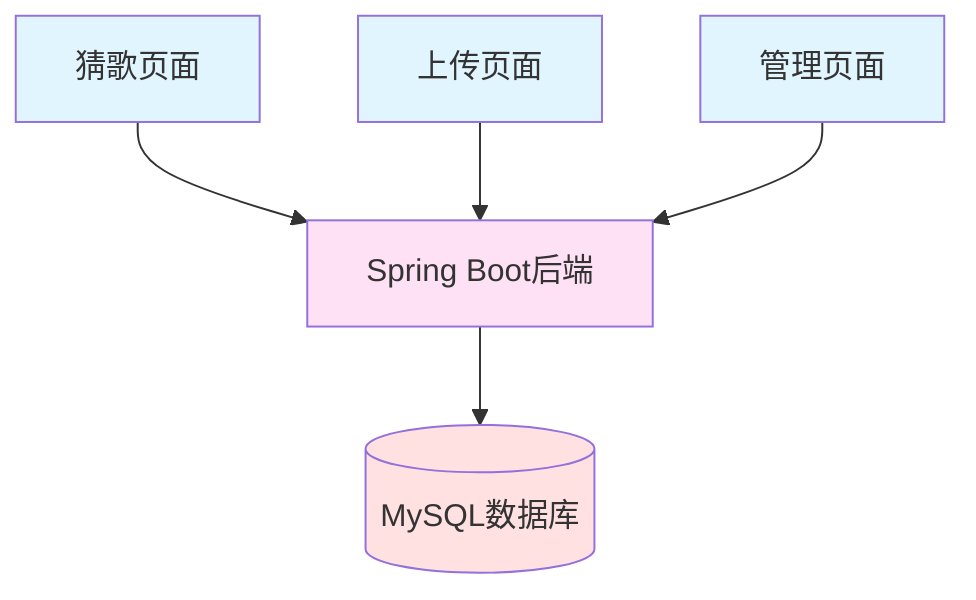

# Vocaloid猜歌游戏 - 系统架构图

```mermaid
graph TB
    A[猜歌页面] --> D[Spring Boot后端]
    B[上传页面] --> D
    C[管理页面] --> D
    D --> E[(MySQL数据库)]
    
    style A fill:#e1f5ff
    style B fill:#e1f5ff
    style C fill:#e1f5ff
    style D fill:#ffe1f5
    style E fill:#ffe1e1
```

