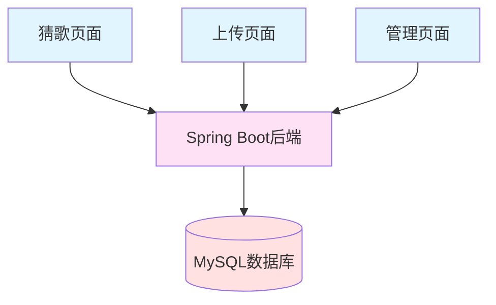
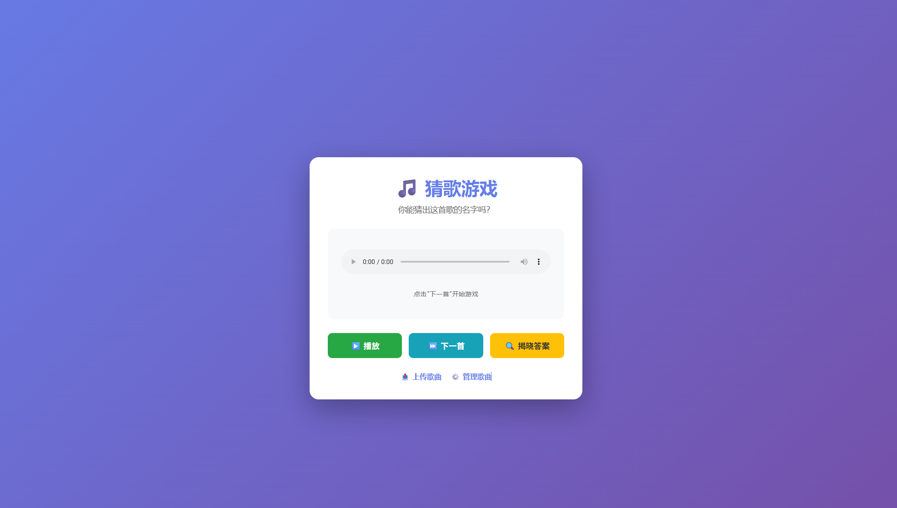
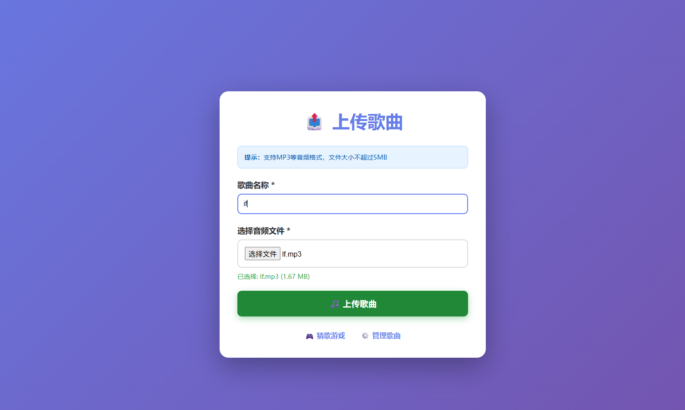
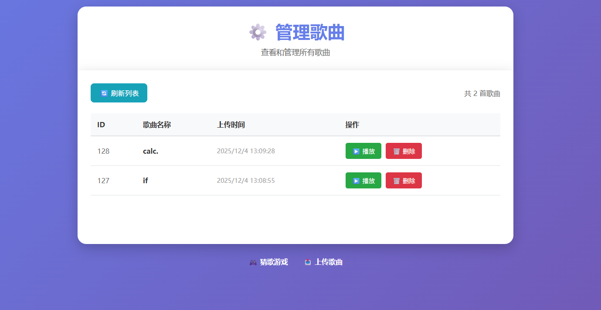
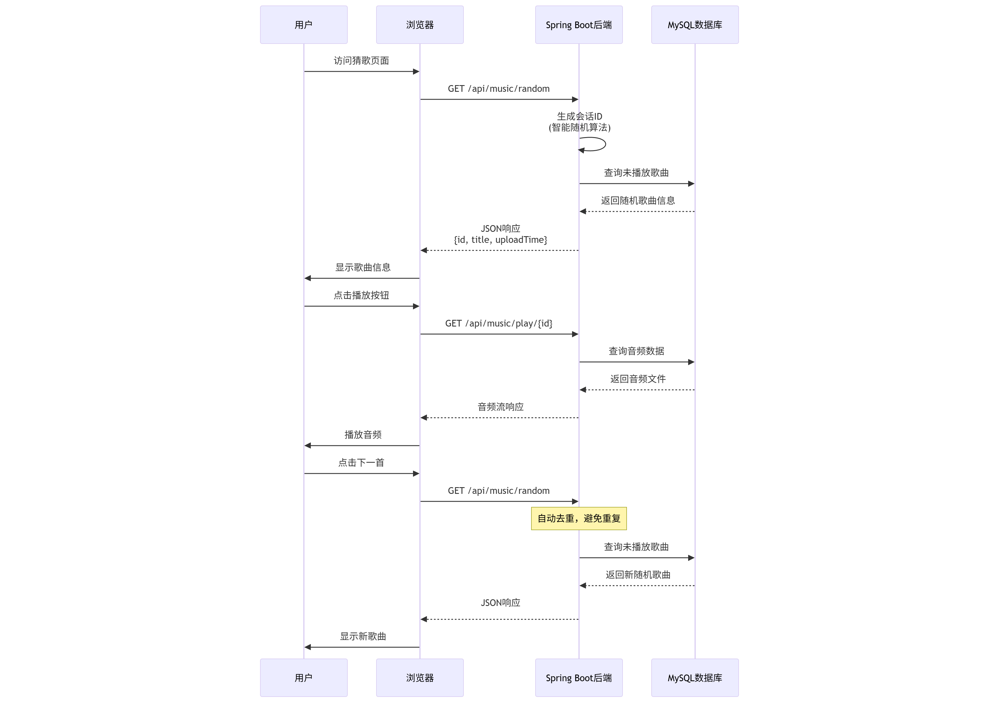
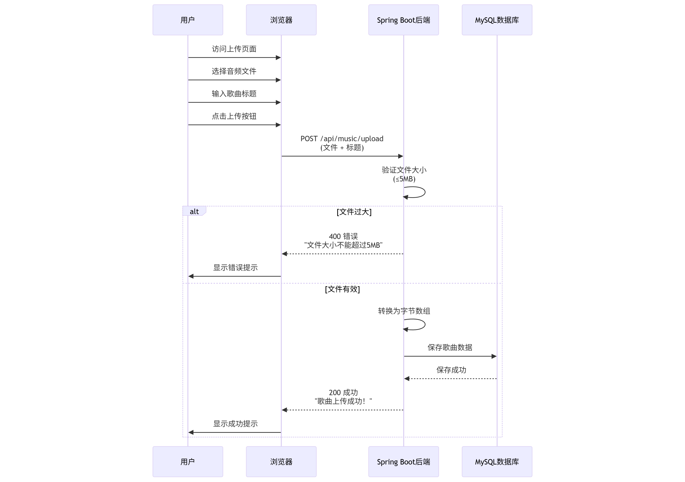
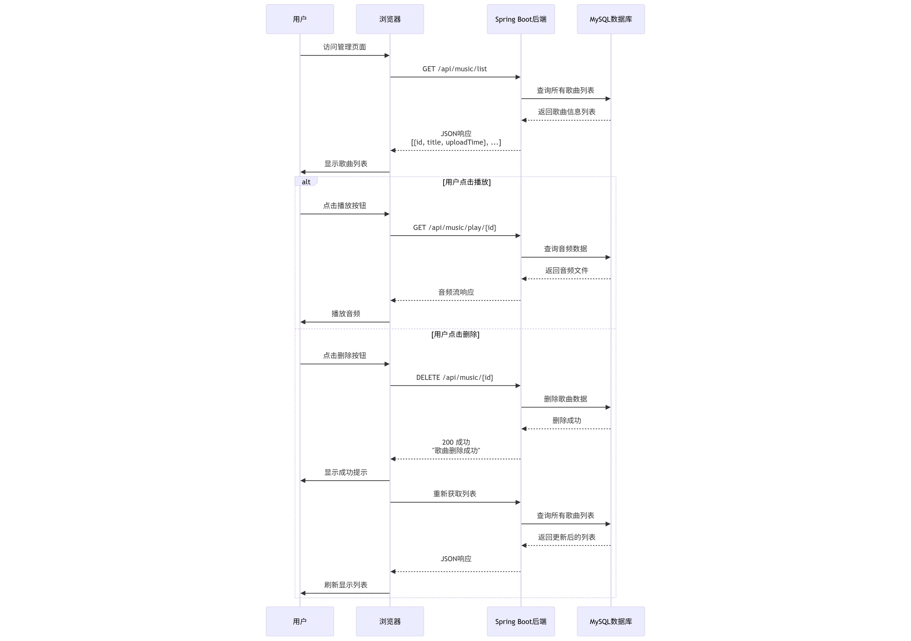

# Vocaloid猜歌游戏 - 设计稿

## 目录

1. [系统架构](#系统架构)
2. [页面设计](#页面设计)
   - [猜歌页面](#猜歌页面)
   - [上传页面](#上传页面)
   - [管理页面](#管理页面)
3. [工作流程](#工作流程)
   - [猜歌页面工作流程](#猜歌页面工作流程)
   - [上传页面工作流程](#上传页面工作流程)
   - [管理页面工作流程](#管理页面工作流程)
4. [API接口说明](#api接口说明)

---

## 系统架构



**架构说明：**
- 三个前端页面（猜歌页面、上传页面、管理页面）通过HTTP请求与Spring Boot后端交互
- Spring Boot后端负责业务逻辑处理和数据持久化
- MySQL数据库存储歌曲信息和音频数据

---

## 页面设计

### 猜歌页面

**页面描述：**
猜歌游戏主界面采用紫色渐变背景，中央为白色圆角卡片，包含以下元素：

1. **标题区域**
   - 音乐图标（♪）+ "猜歌游戏"标题（深蓝紫色）
   - 副标题："你能猜出这首歌的名字吗?"（浅灰色）

2. **音频播放器区域**
   - 水平音频播放器组件，包含：
     - 左侧播放按钮（▶）
     - 时间显示："0:00 / 0:00"
     - 水平进度条
     - 右侧音量图标和更多选项图标
   - 提示文字："点击"下一首"开始游戏"（灰色）

3. **操作按钮区域**
   - 三个主要按钮（水平排列）：
     - 绿色"播放"按钮（▶图标）
     - 浅蓝/青色"下一首"按钮（▶▶图标）
     - 黄色/橙色"揭晓答案"按钮（🔍图标）

4. **导航链接**
   - "上传歌曲"链接（房屋图标）
   - "管理歌曲"链接（齿轮图标）

**访问地址：** `http://localhost:10001/` 或 `http://localhost:10001/index.html`



---

### 上传页面

**页面描述：**
歌曲上传界面采用紫蓝色渐变背景，中央为白色圆角卡片，包含以下元素：

1. **标题区域**
   - 上传图标（向上箭头+音符）+ "上传歌曲"标题（紫色大字体）

2. **提示横幅**
   - 浅蓝色圆角横幅
   - 提示文字："提示:支持MP3等音频格式,文件大小不超过5MB"

3. **表单输入区域**
   - **歌曲名称***（必填）
     - 文本输入框，当前示例值："if"
   - **选择音频文件***（必填）
     - "选择文件"按钮
     - 禁用的文本输入框，显示文件名："If.mp3"
     - 文件信息显示："已选择: If.mp3 (1.67 MB)"

4. **提交按钮**
   - 绿色圆角按钮，带音符图标和"上传歌曲"文字

5. **导航链接**
   - "猜歌游戏"链接（音符图标）
   - "管理歌曲"链接（齿轮图标）

**访问地址：** `http://localhost:10001/upload` 或 `http://localhost:10001/upload.html`



---

### 管理页面

**页面描述：**
歌曲管理界面采用紫色渐变背景，中央为大型白色圆角卡片，包含以下元素：

1. **标题区域**
   - 紫色齿轮图标 + "管理歌曲"标题（紫色）
   - 副标题："查看和管理所有歌曲"（灰色小字）

2. **操作栏**
   - 左侧："刷新列表"按钮（浅蓝色，带刷新图标）
   - 右侧："共 X 首歌曲"统计信息（灰色）

3. **歌曲列表表格**
   - 表头（四列）：
     - **ID**
     - **歌曲名称**
     - **上传时间**
     - **操作**
   - 数据行示例：
     - ID: 128 | 歌曲名称: calc. | 上传时间: 2025/12/4 13:09:28 | 操作: [播放(绿色)] [删除(红色)]
     - ID: 127 | 歌曲名称: if | 上传时间: 2025/12/4 13:08:55 | 操作: [播放(绿色)] [删除(红色)]

4. **导航链接**
   - "猜歌游戏"链接（紫色控制器图标）
   - "上传歌曲"链接（紫色上传图标）

**访问地址：** `http://localhost:10001/manage` 或 `http://localhost:10001/manage.html`



---

## 工作流程

### 猜歌页面工作流程

**流程图说明：**

参与者包括：用户、浏览器、Spring Boot后端、MySQL数据库

**流程步骤：**

1. **初始歌曲获取**
   - 用户访问猜歌页面
   - 浏览器发送 `GET /api/music/random` 请求到Spring Boot后端
   - 后端执行：
     - 生成会话ID（智能随机算法）
     - 查询MySQL数据库获取未播放歌曲
   - 数据库返回随机歌曲信息
   - 后端返回JSON响应：`{id, title, uploadTime}`
   - 浏览器显示歌曲信息给用户

2. **播放歌曲**
   - 用户点击播放按钮
   - 浏览器发送 `GET /api/music/play/{id}` 请求
   - 后端查询数据库获取音频数据
   - 数据库返回音频文件
   - 后端返回音频流响应
   - 浏览器播放音频

3. **获取下一首歌曲**
   - 用户点击"下一首"按钮
   - 浏览器发送 `GET /api/music/random` 请求
   - 后端执行：
     - 自动去重，避免重复
     - 查询数据库获取未播放歌曲
   - 数据库返回新随机歌曲
   - 后端返回JSON响应
   - 浏览器显示新歌曲



---

### 上传页面工作流程

**流程图说明：**

参与者包括：用户、浏览器、Spring Boot后端、MySQL数据库

**流程步骤：**

1. **用户操作**
   - 用户访问上传页面
   - 用户选择音频文件
   - 用户输入歌曲标题
   - 用户点击上传按钮

2. **浏览器请求**
   - 浏览器发送 `POST /api/music/upload` 请求
   - 请求包含：文件 + 标题

3. **后端验证**
   - Spring Boot后端验证文件大小（≤ 5MB）

4. **处理分支（alt）**

   **分支1：文件过大（错误场景）**
   - 后端返回 400 错误
   - 错误消息："文件大小不能超过5MB"
   - 浏览器显示错误提示

   **分支2：文件有效（成功场景）**
   - 后端将文件转换为字节数组
   - 后端保存歌曲数据到MySQL数据库
   - 数据库返回保存成功
   - 后端返回 200 成功响应
   - 成功消息："歌曲上传成功!"
   - 浏览器显示成功提示



---

### 管理页面工作流程

**流程图说明：**

参与者包括：用户、浏览器、Spring Boot后端、MySQL数据库

**流程步骤：**

1. **获取歌曲列表**
   - 用户访问管理页面
   - 浏览器发送 `GET /api/music/list` 请求
   - 后端查询数据库获取所有歌曲列表
   - 数据库返回歌曲信息列表
   - 后端返回JSON响应：`[{id, title, uploadTime}, ...]`
   - 浏览器显示歌曲列表

2. **播放歌曲**
   - 用户点击播放按钮
   - 浏览器发送 `GET /api/music/play/{id}` 请求
   - 后端查询数据库获取音频数据
   - 数据库返回音频文件
   - 后端返回音频流响应
   - 浏览器播放音频

3. **删除歌曲**
   - 用户点击删除按钮
   - 浏览器发送 `DELETE /api/music/{id}` 请求
   - 后端删除数据库中的歌曲数据
   - 数据库返回删除成功
   - 后端返回 200 成功响应："歌曲删除成功"
   - 浏览器显示成功提示
   - 后端重新获取列表（查询所有歌曲）
   - 数据库返回更新后的列表
   - 后端返回JSON响应
   - 浏览器刷新显示列表



---

## API接口说明

### 页面访问

#### 1. 猜歌游戏页面
- **URL**: `http://localhost:10001/` 或 `http://localhost:10001/index.html`
- **方法**: GET
- **说明**: 猜歌游戏主页面

#### 2. 上传歌曲页面
- **URL**: `http://localhost:10001/upload` 或 `http://localhost:10001/upload.html`
- **方法**: GET
- **说明**: 歌曲上传页面

#### 3. 管理歌曲页面
- **URL**: `http://localhost:10001/manage` 或 `http://localhost:10001/manage.html`
- **方法**: GET
- **说明**: 歌曲管理页面

---

### API 接口

#### 1. 获取随机歌曲
- **URL**: `/api/music/random`
- **方法**: GET
- **说明**: 获取一首随机歌曲（智能随机，避免重复）
- **请求头**: 无特殊要求
- **响应**: 
  ```json
  {
    "id": 1,
    "title": "歌曲名称",
    "uploadTime": "2024-01-01T12:00:00"
  }
  ```

#### 2. 获取会话统计信息
- **URL**: `/api/music/stats`
- **方法**: GET
- **说明**: 获取当前会话的统计信息
- **响应**:
  ```json
  {
    "playedCount": 5,
    "remainingCount": 15
  }
  ```

#### 3. 上传歌曲
- **URL**: `/api/music/upload`
- **方法**: POST
- **Content-Type**: `multipart/form-data`
- **参数**:
  - `file`: 音频文件（必填，最大5MB）
  - `title`: 歌曲名称（必填，最大255字符）
- **响应**: 成功返回 "歌曲上传成功！"，失败返回错误信息

#### 4. 获取所有歌曲列表
- **URL**: `/api/music/list`
- **方法**: GET
- **说明**: 获取所有歌曲，按上传时间倒序排列
- **响应**:
  ```json
  [
    {
      "id": 1,
      "title": "歌曲名称",
      "uploadTime": "2024-01-01T12:00:00"
    }
  ]
  ```

#### 5. 播放歌曲
- **URL**: `/api/music/play/{id}`
- **方法**: GET
- **参数**: `id` - 歌曲ID
- **说明**: 获取歌曲的音频文件
- **响应**: 音频文件流，Content-Type: `audio/mpeg`

#### 6. 删除歌曲
- **URL**: `/api/music/{id}`
- **方法**: DELETE
- **参数**: `id` - 歌曲ID
- **响应**: 成功返回 "歌曲删除成功"，失败返回错误信息

#### 7. 重置会话
- **URL**: `/api/music/reset`
- **方法**: POST
- **说明**: 重置当前会话，清空已播放记录
- **响应**: "会话已重置"

---

### 错误码说明

- **200**: 成功
- **400**: 请求错误（参数错误、文件过大等）
- **404**: 资源不存在
- **500**: 服务器内部错误

---

### 注意事项

1. 所有API都支持跨域请求（`@CrossOrigin`）
2. 文件上传限制为5MB
3. 支持的音频格式：MP3等常见音频格式
4. 会话ID基于IP和User-Agent自动生成
5. 智能随机算法会避免在单次会话中重复播放同一首歌曲

---

## 设计说明

### 视觉设计特点

- **配色方案**：紫色渐变背景，白色卡片容器
- **交互元素**：绿色（播放/上传）、蓝色（操作）、红色（删除）、黄色（特殊操作）
- **布局风格**：居中卡片式布局，圆角设计，阴影效果
- **响应式设计**：支持桌面和移动设备

### 用户体验设计

- **清晰的视觉层次**：标题、内容、操作按钮层次分明
- **即时反馈**：操作后立即显示成功/错误提示
- **便捷导航**：页面底部提供快速导航链接
- **信息展示**：文件大小、上传时间等关键信息清晰展示

---

**文档版本**: 1.0  
**最后更新**: 2025-12-04

